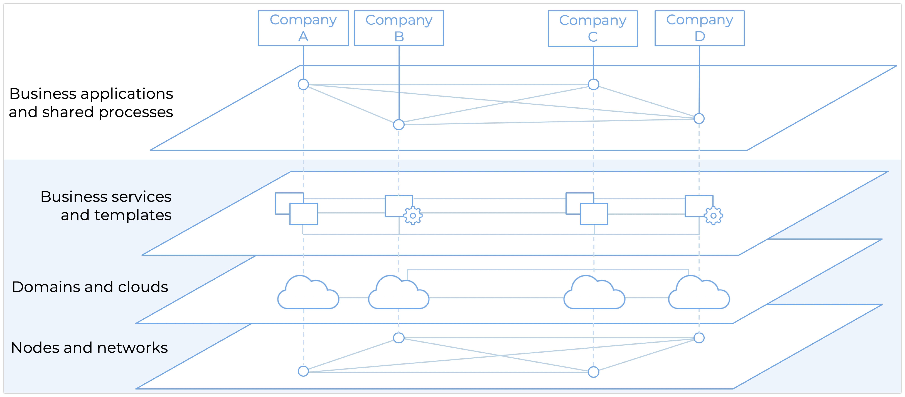

.. _basics:

=====================
Understanding Insolar
=====================

Insolar aims to deliver an open and collaborative environment required to enable third-party companies to build and maintain templates and services, provide hardware capacities, and adapt services and functions to local practices and legal and regulatory requirements.

To understand Insolar, let's zoom out and take a look at the big picture.

.. _big_pic:

The Big Picture
---------------

When automating complex business relations with counterparties and consumers, every enterprise (actor), however big and reliable, is having a hard time:

* convincing the counterparties that they (the actor) should hold a centralized database and define the rules of processing;
* maintaining a centralized database and being responsible for all business processes and their automation.

These pains go away with a blockchain or, more strictly, DLT: it effectively shifts those responsibilities from one single actor to a decentralized setup while ensuring the consistency and behavior of both the infrastructure and all actors involved, trusted or malicious. The problem with most DLTs is that they do not keep the needs of enterprises in mind from the very beginning. Conversely, Insolar's goal is to make blockchain easy-to-use for any enterprise, big or small.

Below is an illustration of the layered architecture that Insolar introduces to address this problem. Such an architecture makes platform design a challenging task, but with proper implementation, it enables building complex solutions with better control of development risks and, later, ownership costs. Insolar is currently designing the proposed platform in an incremental fashion allowing it to progressively grow into the ultimate decentralized collaborative environment for various kinds of industries, companies, governments, and communities.

The architecture is split into four layers:

#. At the top layer are distributed business applications owned by and tailored for companies who serve other companies.
#. The next layer represents business services and templates for business applications provided by vendors. Templates are the application building blocks.
#. At the third layer are :ref:`clouds <fed_of_clouds>` and :ref:`domains <domains>`. Cloud infrastructure can be public and offered by governments or even communities as a public good — crowd-sourced computational resources. Domains serve as governance tools. Starting from this layer, the abstraction complexity grows progressively right up to the top layer.
#. At the bottom layer are providers of :ref:`hardware capacities <globulas>` organized into national and/or industrial compute and storage resources.

Insolar focuses its research and development in the three bottom layers making the top one easy to use for enterprises wishing to integrate with the Insolar blockchain.

To achieve scalability and transparency from the ground up, Insolar introduces several design aspects to its bottom layer. To understand the aspects, let's dive in the complexities of decentralization.

.. _centralization_vs_decentralization:

Centralization vs. Decentralization
-----------------------------------

Broadly, existing blockchains and DLTs offer two major opposing approaches to processing data:

.. _two_approaches:

* **Approach 1**: Data is processed and recorded by "full" nodes (and/or "miners"). In this approach, a common ledger stores the said data and the ledger is maintained by all nodes. Decentralization here comes at the cost of low network throughput and high computation expenses.
* **Approach 2**: Data is processed in a centralized way involving only a subset of nodes. This approach offers higher throughput rates but requires the network to transfer potentially large objects and raises questions regarding centralization.

Insolar extends the latter approach by introducing the benefits of the former via its omni-scaling feature.

.. _omni_scaling:

Omni-Scaling
~~~~~~~~~~~~

Omni-scaling is an integral feature that utilizes the following aspects:

* :ref:`Multichain organization of storage <objects>`. All smart contracts are objects stored as separate chains of records — :term:`lifelines <lifeline>`.
* :ref:`Multi-role model of nodes <multi_role_nodes>`. This model divides the workload between subsets of nodes, thus minimizing the amount of information the nodes have to exchange. Nodes can be:

  * *virtual executors* that process transactions;
  * *virtual validators* that validate them;
  * *light material executors* that persist processing results;
  * *light material validators* that validate storage operations;
  * *heavy material* nodes that serve as cold storage, while all the light material ones cache hot data.

* Innovative approach to :ref:`distributing workloads <network_consensus>` across the network. To decentralize what is otherwise a centralized processing approach, the network works in cycles and uses randomization (entropy) to select (not elect) the nodes to perform the aforementioned roles *for each object* in the ledger *in every processing cycle*.

Omni-scaling spans both processing and persistence parts of the :ref:`bottom layer <big_pic>`. Let's take a closer look at both parts.

.. _processing:

Processing
^^^^^^^^^^

Insolar lives on the principle of actions **executed by one, validated by many**.

The network randomizes (:term:`via pulses <pulse>`) the selection of both:

* an executor for *each object* in *every processing cycle*;
* and, *in the next cycle*, a set of validators for each processed object.

The processing mechanism ensures that no :ref:`executor can validate <virtual_execution_validation>` its own output, and no node can predict the nature of its workload during the next cycle. If a transaction takes longer than one cycle, the executor node has to receive a permission to continue execution from the would-be executor of the next cycle. The amount of validators can be tuned according to the perceived value at risk of the transaction to process.

Both executors and validators are :ref:`virtual nodes <virtual>` with :ref:`dynamic roles <dynamic_roles>`, and together they make up the processing part of the :ref:`bottom layer <big_pic>`.

The omni-scaling feature addresses the shortcomings of the :ref:`two aforementioned approaches to processing data <two_approaches>`:

* Executor and validator nodes are selected randomly and unpredictably, so there is no centralized authority per se.
* Network data exchange is limited to a handful of nodes.

In addition, Insolar caches the frequently accessed data as it divides hot and cold storage in the persistence part of the :ref:`bottom layer <big_pic>`.

.. _persistence:

Persistence
^^^^^^^^^^^

Nothing is really out of scope with regards to storage when it comes to tracking a complex transaction in its entirety. All data pertaining to a transaction are relevant and, ideally, should be stored together. This includes, if need be, the incoming documents that trigger transactions. A common approach is to store the heavy documents off-chain and reference them with a hash. Insolar can store any documents on-chain and provide additional guarantees for contexts where it is important. However, this makes storage more expensive.

To ease the burden of having to store large objects on-chain, Insolar:

* minimizes the number of nodes having to access such objects as described in the :ref:`processing section <processing>`;
* divides the nodes that carry the persistence layer into light and heavy material nodes, acting as hot and cold storage respectively.

Light nodes are responsible for building blocks and connecting them into chains as well as forming units of :ref:`physical storage <ledger>` — :term:`jet drops <jet drop>`. :ref:`Light material nodes <light_material>` act effectively as a cache over a predefined (configurable) amount of processing cycles, while :ref:`heavy material nodes <heavy_material>` provide the long-term storage. This avoids tapping into the cold storage for frequently accessed objects. Only material nodes can access the stored data — virtual nodes have to request access from light nodes that serve as cache.

One would argue that to process an object, you must eventually bring it up from cold storage and this is expensive. Insolar, however, does it in a very limited number of cases and only from heavy to light material nodes. The nodes still need to pass the data, but only the ones that are directly involved in the processing of said data. The number of such nodes is configurable.

Conversely, in common-style blockchain platforms, the full network processes and exchanges data.

.. _pub_v_priv_and_permissioned_v_permissionless:

Permissioned vs. Permissionless and Public vs. Private
------------------------------------------------------

In the context of peer-to-peer payments, virtually any entity should have straightforward access, so permissionless networks make sense. However, any practical setup for enterprise is permissioned as enterprises need to safeguard valuable data.

A typical setup for any medium-to-large enterprise has the following aspects to consider:

#. Joining the network. When dealing with financial markets, supply chains, or any non-trivial network of participants in a complex business transaction, a counterparty has to undergo some know-your-customer (KYC) procedure which is largely defined by a certain set of regulations.

#. Access rights to information. Not all counterparties to, e.g., a derivative trade or trade finance will give the green light to exposing significant conditions to certain participants. Usually, in trade context, some conditions are kept secret from competitors and all conditions are accessible to, e.g., regulatory bodies. So, permissioned access to certain objects is a requirement.

#. Validation procedures after all actors underwent the KYC. Any enterprise has operation departments to check, validate, and settle everything. The enterprise needs custom validation procedures to make sure that:

   * all conditions have been met;
   * the sequence of events has been justified;
   * all legally binding documents are ensured by cryptography;
   * etc.

In addition to the :ref:`omni-scaling <omni_scaling>` bottom layer, Insolar introduces logical business-oriented foundations to the :ref:`layer above <big_pic>` via :ref:`domains <domains>` that serve as units of governance.

Technically, a :term:`domain <domain>` is a special smart contract that defines a framework within which other smart contracts are executed. The framework can include a plethora of things: 

* business logic, e.g., trade finance; 
* access rules — permissioned or permissionless; 
* location (e.g., geographical) in which smart contracts can be executed and their results stored;
* validation consensus rules to configure processing costs (number of validation nodes and/or algorithms) versus value at risk;
* etc.

Since Insolar's code is open-sourced, it can be deployed and used publicly in a permissionless setup. But all the enterprises require permissioned access even on already deployed public networks. This is a major obstacle on the path of blockchain adoption. Insolar will overcome this problem by using carefully implemented domains as they offer enough flexibility to allow the deployment of hybrid public/private networks with complex permissioning schemes.

.. _basics_summary:

Summary
-------

Insolar focuses its research and development in the three bottom layers:

* Provides near linear scalability and uniform resource management (via the omni-scaling feature) in the bottom layer.
* Uses domains in the layer above to allow for hybrid private/public networks with complex permissioning schemes.
* Offers on-demand blockchain-as-a-service solutions for enterprises, thus implementing the next-to-top layer.

As a result, enterprises get the most easy-to-use blockchain solution to automate their intra- and inter-business relations.

To continue the deep dive into Insolar technologies, take a closer look at its :ref:`architecture <architecture>`.
